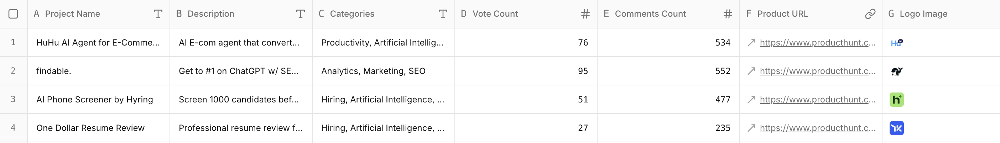

## Introduction

Product Hunt’s is the hottest websiteto discover the hottest new products. But if you want to track vote counts and launch times across multiple days, it’s not easy and always time-consuming. However, it's important for product teams to track the trends of data on PH and figure out the best launch date.

With **Sheet0**, you can turn this into a one-prompt workflow:
Instantly extract product names, vote counts, and launch times into a clean spreadsheet, ready for analysis or trend tracking.

---

## Prompt Formula

The Formula is **Source + Goal + Fields.**

Every good prompt has three parts:

- **Source:** Where to get the data (Twitter, Product Hunt, YC website, etc.)
- **Goal:** What you want (startups, communities, jobs, users…)
- **Fields:** The columns you need (name, bio, website, followers, etc.)

---

## Prompt of This Case

**Prompt:**  
Scrape the vote counts and launch times of projects from Product Hunt  
**URL:** [https://www.producthunt.com/leaderboard/daily/2025/7/27?ref=header_nav](https://www.producthunt.com/leaderboard/daily/2025/7/27?ref=header_nav)

For each product, collect:

- Product name
- Vote count
- Launch time

---

## Results

As an example, we ran this prompt on the **July 27, 2025 leaderboard.**  
**Sheet0** generated a structured table with product names, vote counts, and launch times.

**Preview (first 4 rows):**  

---

## Try It Yourself

Feel free to run this case in **Sheet0** with just one prompt, and watch the day’s Product Hunt leaderboard turn into structured data in seconds.
