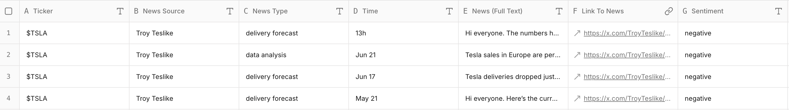

## Introduction

X (Twitter) is a key place where industry voices share breaking news, estimates, and debates. However, analyzing these posts over time is hard. The platform doesn’t provide a way to export them into structured spreadsheets. If you want to review all posts from a specific month, you’d have to scroll, copy, and paste one by one.

With **Sheet0**, you can turn this into a one-prompt workflow: instantly collect posts from any account, organized into a clean dataset with tickers, timestamps, sentiment, and key debates.

---

## Prompt Formula

The Formula is **Source + Goal + Fields.**

Every good prompt has three parts:

- **Source:** Where to get the data (Twitter, Product Hunt, YC website, etc.)
- **Goal:** What you want (startups, communities, jobs, users…)
- **Fields:** The columns you need (name, bio, website, followers, etc.)

---

## Prompt of This Case

**Prompt:**  
Scrape all posts from [somebody’s link @xxx] during **July 2025**.  

For each post, collect:  
- Ticker  
- News Source  
- News Type  
- Time  
- News (full text)  
- Link to News  
- Sentiment  
- News takeaway  
- Key Debate

---

## Results

As an example, we ran this prompt on an **EV industry KOL**.  
Sheet0 extracted their July 2025 posts and transformed them into a structured table.

**Preview (first 4 rows):**  


---

## Try It Yourself

Feel free to run this case in **Sheet0** with just one prompt, and get real data in seconds!

<!-- ## Using Plugin

This starter kit uses the code highlight plugin [gatsby-remark-vscode](https://github.com/andrewbranch/gatsby-remark-vscode).
Please refer to the link for more detailed instructions. It's a great plugin. 👍

## React JSX with line highlighting

```jsx
var ProfileLink = React.createClass({
  render: function () {
    return (
      <a href={"https://www.facebook.com/" + this.props.username}>
        {this.props.username}
      </a>
    )
  },
})
```

## Javascript

```js
import {x, y} as p from 'point';
const ANSWER = 42;

class Car extends Vehicle {
  constructor(speed, cost) {
    super(speed);

    var c = Symbol('cost');
    this[c] = cost;

    this.intro = `This is a car runs at
      ${speed}.`;
  }
}

for (let num of [1, 2, 3]) {
  console.log(num + 0b111110111);
}

function $initHighlight(block, flags) {
  try {
    if (block.className.search(/\bno\-highlight\b/) != -1)
      return processBlock(block.function, true, 0x0F) + ' class=""';
  } catch (e) {
    /*handle exception*/
        var e4x =
        <div>Example
            <p>1234</p></div>;
  }
  for (var i = 0 / 2; i < classes.length; i++) {
  // "0 / 2" should not be parsed as regexp
    if (checkCondition(classes[i]) === undefined)
      return /\d+[\s/]/g;
  }
  console.log(Array.every(classes, Boolean));
}

export  $initHighlight;
```

## HTML

```html
<!doctype html>
<html lang="en">
  <head>
    <meta charset="utf-8" />
    <title>Hello world</title>
    <link
      href="http://fonts.googleapis.com/css?family=Roboto:400,400italic,700,700italic"
      rel="stylesheet"
      type="text/css"
    />
    <link rel="stylesheet" href="index.css" />
  </head>
  <body>
    <div id="app"></div>
    <script src="//cdnjs.cloudflare.com/ajax/libs/less.js/2.5.1/less.min.js"></script>
    <script src="vendor/prism.js"></script>
    <script src="examples.bundle.js"></script>
  </body>
</html>
```

## CSS

```css
pre[class*="language-"],
code {
  color: #5c6e74;
  font-size: 13px;
  text-shadow: none;
  font-family: Consolas, Monaco, "Andale Mono", "Ubuntu Mono", monospace;
  direction: ltr;
  text-align: left;
  white-space: pre;
  word-spacing: normal;
  word-break: normal;
  line-height: 1.5;
  tab-size: 4;
  hyphens: none;
}
pre[class*="language-"]::selection,
code::selection {
  text-shadow: none;
  background: #b3d4fc;
}
@media print {
  pre[class*="language-"],
  code {
    text-shadow: none;
  }
}
pre[class*="language-"] {
  padding: 1em;
  margin: 0.5em 0;
  overflow: auto;
  background: #f8f5ec;
}
:not(pre) > code {
  padding: 0.1em 0.3em;
  border-radius: 0.3em;
  color: #db4c69;
  background: #f9f2f4;
}
``` -->
