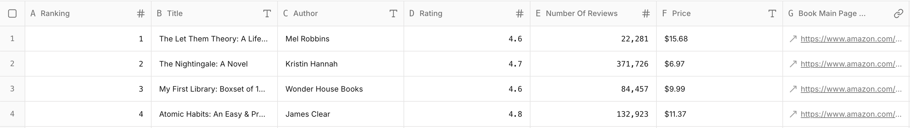

## Introduction

Amazon’s Best Seller in Books list is one of the most visited pages for book lovers, publishers, and researchers. But there’s a catch: Amazon doesn’t give you a clean export option. If you want to analyze the top 100 books, you’d have to copy-paste each title, ranking, and price by hand, and that’s painful.

With Sheet0, you can turn this messy manual task into a one-prompt workflow. In less than a minute, you’ll have a structured CSV with all the book details ready for analysis.

---

## Prompt Formula

The Formula is **Source + Goal + Fields.**

Every good prompt has three parts:

- **Source:** Where to get the data (Twitter, Product Hunt, YC website, etc.)
- **Goal:** What you want (startups, communities, jobs, users…)
- **Fields:** The columns you need (name, bio, website, followers, etc.)

---

## Prompt of This Case

**Prompt:**  
Scrape the top 100 books from Amazon's Best Seller in Books list from
https://www.amazon.com/best-sellers-books-Amazon/zgbs/books/ref=zg_bs_nav_books_0

For each book, get:

- Title
- Ranking
- Price
- Number of reviews
- Description (from the book’s main page)

---

## Results

**Preview (first 4 rows):**  


---

## Try It Yourself

Feel free to run this case in **Sheet0** with just one prompt, and get real data in seconds!

<!-- ### Set Front matter

```md
---
title: "Getting Started"  // Post title
category: "Instruction"   // Post category
date: "2020-03-01 12:00:00 +09:00"  // Current time
desc: "Let's start making blogs step by step!"  // Post desc
thumbnail: "./images/getting-started/thumbnail.jpg" // Post thumbnail
alt: "apple and shaking hands"  // [optional] thumbnail image alt
---
```

- _NOTE_ : Properties other than alt must be required.

## Edit About Page

Easy. You can modify the `blog/about.md` file. If you need additional styling, give an id or class to a specific element in `about.md` and try to control it in the `pages/about.js` file.

An example is shown below.

### blog/about.md

```md
<h2 id="title">Hello</h2>
```

### pages/about.js

```js
const About = () => {
  /* ... */
}

const Container = styled(Markdown).attrs({
  as: "main",
})`
  width: var(--post-width);
  margin: 0 auto;
  margin-top: 80px;
  margin-bottom: 6rem;

  @media (max-width: ${({ theme }) => theme.device.sm}) {
    margin-top: var(--sizing-xl);
    width: 87.5%;
  }

  h1 {
    margin-bottom: 2rem;
  }

  h2 {
    margin-top: var(--sizing-lg);

    @media (max-width: ${({ theme }) => theme.device.sm}) {
      font-size: 1.75rem;
    }
  }

  h3 {
    @media (max-width: ${({ theme }) => theme.device.sm}) {
      font-size: 1.25rem;
    }
  }

  /* You can Add Additional Styling here */

  #title {
    font-size: 60px;
  }
`

export default About
```

## Other Customization

You can freely customize each componentfile using the styled-component. If you want to change the style globally, you can change the `styles/globalStyle` file.

Thank you for using `gatsby-starter-apple`. If you have any questions, please leave them on this **[link](https://github.com/sungik-choi/gatsby-starter-apple/issues).** -->
